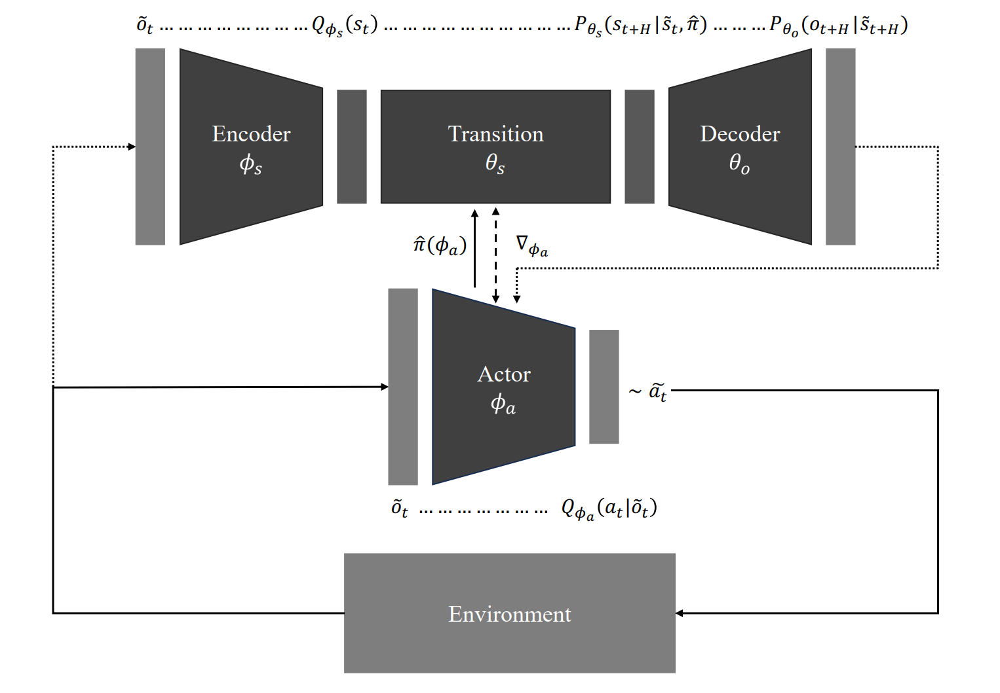

<h2 align="center">Deep Active Inference Agents for Delayed and Long-Horizon Environments</h2>  
<p align="center">
    <a href="https://yavaryeganeh.github.io/">Yavar Taheri Yeganeh</a>
    ·
    <a href="https://ise.rutgers.edu/mohsen-jafari">Mohsen Jafari</a>
    ·
    <a href="https://www.mecc.polimi.it/en/research/faculty/prof-andrea-matta">Andrea Matta</a>

---


With the recent success of world-model agents—which extend the core idea of model-based reinforcement learning by learning a differentiable model for sample-efficient control across diverse tasks—active inference (AIF) offers a complementary, neuroscience-grounded paradigm that unifies perception, learning, and action within a single probabilistic framework powered by a generative model. Despite this promise, practical AIF agents still rely on accurate immediate predictions and exhaustive planning, a limitation that is exacerbated in delayed environments requiring plans over long horizons—tens to hundreds of steps. Moreover, most existing agents are evaluated on robotic or vision benchmarks which, while natural for biological agents, fall short of real-world industrial complexity. **Deep AIF** addresses these limitations with a **generative–policy architecture** featuring:

- **(i)** Multi-step latent transition that lets the generative model predict an entire horizon in a single look-ahead.
- **(ii)** Integrated policy network that enables the transition and receives gradients of the expected free energy.
- **(iii)** Alternating optimization scheme that updates model and policy from a replay buffer.
- **(iv)** Single gradient step that plans over long horizons, eliminating exhaustive planning from the control loop.

Along with the **Deep AIF** implementation and supporting codes, the current repository also includes a simulated industrial environment that mimics a realistic industrial scenario with delayed and long-horizon settings. The empirical results confirm the effectiveness of the proposed approach, demonstrating that the coupled world-model with the AIF formalism yields an end-to-end probabilistic controller capable of effective decision making in delayed, long-horizon settings without handcrafted rewards or expensive planning. More benchmarks and results will be included.

*More codes will be released soon!*

## Requirements

You need a Python environment with the following libraries (and other supporting ones):

```
torch>=2.1.1
numpy>=1.24.3
simpy>=4.0.1
```

## Contact

For inquiries or collaboration, please reach out to **yavar.taheri@polimi.it** or **yavaryeganeh@gmail.com**.

## Citation

Yeganeh, Y. T., Jafari, M., & Matta, A. (2025). Deep Active Inference Agents for Delayed and Long-Horizon Environments. *arXiv preprint arXiv:2505.19867*.
```
@article{yeganeh2025deep,
  title={Deep Active Inference Agents for Delayed and Long-Horizon Environments},
  author={Yeganeh, Yavar Taheri and Jafari, Mohsen and Matta, Andrea},
  journal={arXiv preprint arXiv:2505.19867},
  year={2025}
}
```
